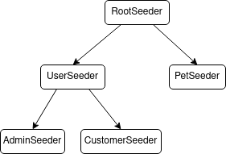

## Seeder

Seeder class is how we provide a way to insert data into databases, and could be executed by the command line or by helper method. Is an abstract class with one method to be implemented, and a helper function to run some more seeder sequentially.

```typescript
class UserSeeder extends Seeder {
  async run(connection: Connection) {
    ...
  }
}
```

### `run`

This function is the one that needs to be defined when extending the class. Could use `call` to run some other seeders.

```typescript
run(connection: Connection): Promise<void>
```

```typescript
async run(connection: Connection) {
    await new UserFactory().createMany(10)

    await this.call(connection, [PetSeeder])
}
```

### `call`

This function allow to run some other seeders in a sequential way.

In order to use seeders from cli command, a default seeder class must be provided as root seeder, working as a tree structure.

<p align="center">
  
</p>
